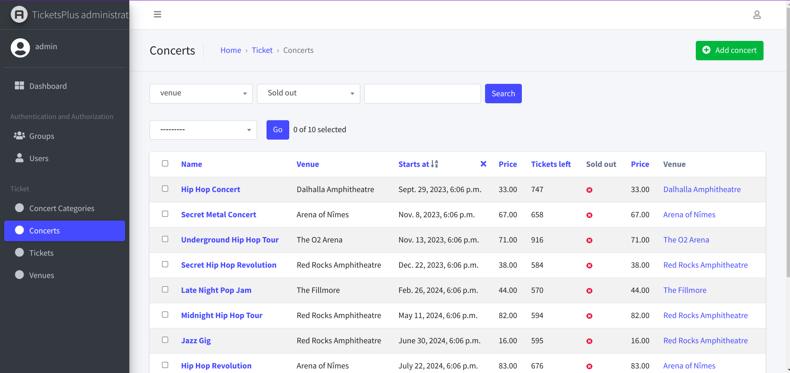

# Concert Ticket

## Install packages
```shell
poetry install
```

## Setup db tables
```shell
python3 manage.py migrate
```

## Run Server
```shell
python3 manage.py runserver
```

# Preview

### Concert model 



### Ticket model


### Venue model


### Venue Tabular Inline(Concert)
